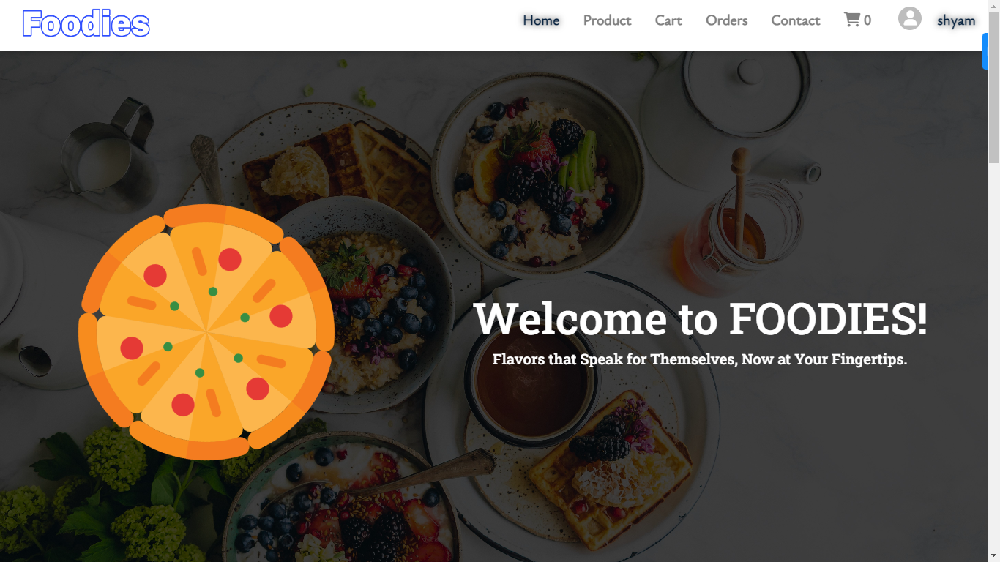
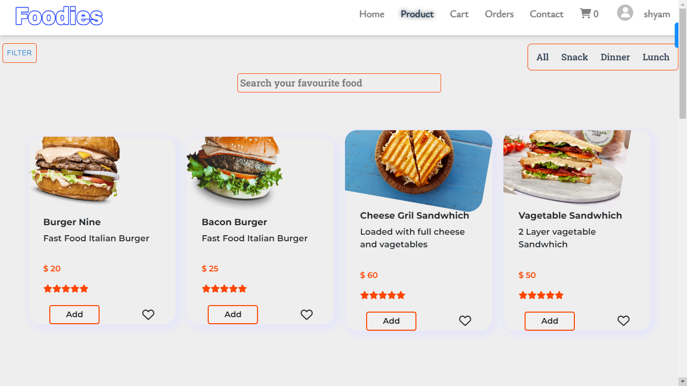
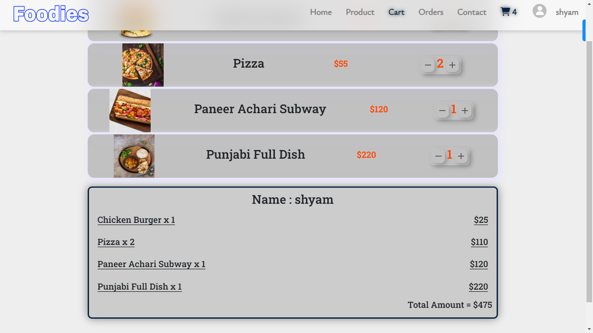

# FOODIES - Food Ordering App
FOODIES is a full-stack web application developed using the MERN stack (MongoDB, Express.js, React.js, Node.js) that allows users to order food online. It provides various functionalities such as adding 
    items to cart, placing orders, filtering based on meal timings (breakfast, lunch, dinner), filtering based on food categories, and searching for specific items and Get your bill after placing an order.

<!-- [link text](url) -->

 

## Features
- **User Authentication:** Users can create an account, log in, and log out securely.
- **Add to Cart Functionality:** Users can add food items to their cart while browsing the available options..
- **Place Orders**: Once items are added to the cart, users can place orders securely.
- **Filtering**: Users can filter food items based on meal timings (breakfast, lunch, dinner) and food categories.
- **Search**: Users can search for specific food items using the search functionality.
- **Redux Integration**: Redux is used for state management, providing a seamless user experience.

## Modules

## Technologies Used
- **Frontend**: 

  

- **Backend**: 

  

- **Database** : 

  

- **Authentication**: JWT (JSON Web Tokens)

## Installation
To run this project locally, follow these steps:

1. **Clone the Repository**
       
        git clone https://github.com/ShyamJP/Foodies

2. **Install Dependencies**
       
        cd client
        npm install
        cd server
        npm install

3. **Setup your DB and SECRET KEY as per .env.example file in server**

4. **Start the Server**:
       
        npm run dev

5. **Start the client**:
       
        npm start

6. **Open your browser and navigate to http://localhost:3000 to start exploring FOODIES.**

## Contributions
Foodies welcomes contributions from the community! Whether it's bug fixes, feature enhancements, or feedback, your input is valuable. Feel free to open an issue or submit a pull request.

This project is under Construction so improvement is going on ..!